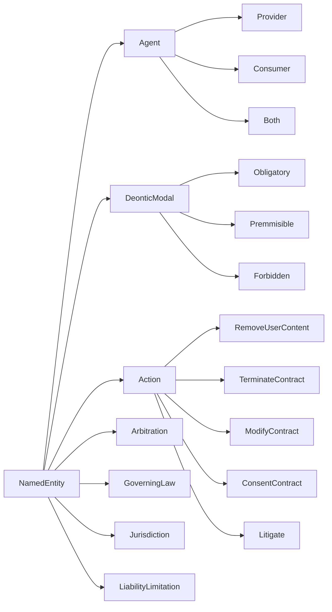

# Terms of Service Unfair Clauses Detection using Prompt Engineering

## Ontologies and Knowledge Graphs

### Unfair Terms

**Competency Questions**

| Arbitration |
|-------------|
| Is participation in arbitration fully optional for the consumer? |
| Does the arbitration clause make arbitration mandatory before any court action can be taken? |
| Does the arbitration clause require arbitration to take place in another country? |
| Is the arbitration process based on established law, or is it solely at the arbitrator's discretion? |

| Governing Law |
|---------------|
| What law is specified to govern disputes arising from the contract? |
| The governing law is fixed (e.g. US federal law) and not the same as the consumer's country of residence |

| Content Removal |
|---------------|
| Can the service provider remove consumer's content? |
| Are specific reasons for content removal explicitly stated in the contract? |
| Does the service provider have full discretion to remove content without providing reasons? |
| Is prior notice required to be given to the user before content removal? |
| Can the consumer retreive the content before removal? |

| Contract by Using |
|---------------|
| Under what conditions is a consumer considered bound by the terms of a contract? |
| In what ways does the consumer provide consent to the terms of a contract? |
| Is the user legally bound by terms just by using the service? |

| Jurisdictions |
|---------------|
| What is the specified jurisdiction in the contract for dispute resolution? |
| Does the jurisdiction clause require dispute resolution in a different city, state, or country from the consumer's residence? |

| Limitation of Liability |
|---------------|
| Does the contract state that the provider is liable for any damages or losses? |
| Is the provider not liable for damages incurred by malware or harmful software, as stated in the contract? |
| Does the contract contain blanket phrases like "to the fullest extent permissible by law" to limit liability? |
| Are there provisions in the contract where the provider disclaims liability for physical injuries, health issues, or loss of life? |
| Does the contract attempt to exempt the provider from liability for gross negligence or intentional damage? |

| Unilateral Modification |
|---------------|
| Is the provider allowed to modify the contract unilaterally? |
| Does the contract require the provider to give notice before making changes? |
| Can the consumer terminate the contract if they disagree with the changes made by the provider? |

| Unilateral Termination |
|---------------|
| Can the provider terminate the contract unilaterally? If so, does it specify specific causes, or termination is allowed without justified cause? |
| Is the provider required to give notice before terminating the contract? |

### DL

TBox
Nc = {Party, Action, Modify, Remove, Consent, Terminate, Litigation, Target, Service, UserContent, Contract, Condition, Unilaterally, WithoutReasonRequired, WithoutPriorNoticeRequired, WithoutConsentRequired, RequiresArbitration, WithForeignLaw, InForeignJurisdiction, Consumer, Provider, LimitationOfLiability, HarmCausedByMalware, HealthIssues, GrossNegligence}
Nr = {hasRightTo, isObligatedTo, isProhibitedTo, onTarget, hasCondition, hasLimitationOfLiabilityFor}
No = {}

ARBITRAJE = consumer .isProhibitedTo Litigate hasCondition WithoutPriorAr

Consumer < Party
Provider < Party
Modify < Action
Remove < Action
Terminate < Action
Consent < Action
Unilaterally < Condition
WithoutPriorNoticeRequired < Condition
WithoutConsentRequired < Condition
Service < Target
UserContent < Target
Contract < Target

CONTENT_REMOVAL_UNFAIR_TERM = para todo Provider .hasRightTo(Remove intersecction UserContent intersecction (Unilaterally or WithoutPriorNoticeRequired or WithoutConsentRequired))
Consumer 

Abox
Party(Github)

[Party]->[Consumer]
[Party]->[Provider]

[Action]->[Modify]
[Action]->[Remove]
[Action]->[Terminate]
[Action]->[Consent]

[Target]->[UserContent]
[Target]->[Contract]
[Target]->[Service]

[Condition]->[Unilaterally]
[Condition]->[WithoutReasonRequired]
[Condition]->[WithoutPriorNoticeRequired]
[Condition]->[WithoutConsentRequired]
[Condition]->[RequiresArbitration]
[Condition]->[WithForeignLaw]
[Condition]->[InForeignJurisdiction]

[LimitationOfLiability]->[HarmCausedByMalware]
[LimitationOfLiability]->[HealthIssues]
[LimitationOfLiability]->[GrossNegligence]

### Unfair Terms Ontology

| Entity              | Subclass of  | Description |
|---------------------|--------------|-------------|
| Agent               | NamedEntity  |             |
| Provider            | Agent        |             |
| Consumer            | Agent        |             |
| Both                | Agent        |             |
| DeonticModal        | NamedEntity  |             |
| Obligatory          | DeonticModal |             |
| Permissible         | DeonticModal |             |
| Forbidden           | DeonticModal |             |
| Action              | NamedEntity  |             |
| RemoveUserContent   | Action       |             |
| TerminateContract   | Action       |             |
| ModifyContract      | Action       |             |
| ConsentContract     | Action       |             |
| Litigate            | Action       |             |
| Arbitration         | NamedEntity  |             |
| GoverningLaw        | NamedEntity  |             |
| Jurisdiction        | NamedEntity  |             |
| LiabilityLimitation | NamedEntity  |             |

Taxonomy representation:

# Entities:
## Parties
- Provider
- Consumer

## deontic classification
- Obligation

## clause type
- Arbitration
- GoverningLaw
- Jurisdiction
- ContentRemoval
- LimitationOfLiability
- Modification
- Termination

## Relations
- 

Idea de paper:

1. Contruir una ontología para representar cláusulas abusivas.
    1.1. Generar CQ limitar el scope de la ontología
2. Representar la ontología como un conjunto de clases Pydantic.
3. Utilizar varios LLMs (CHatgpt4omini, Chatgpt4o, Mistral, Llama) para generar un KG a partir de la ontología.
4. Detectar potentially unfair terms usando el KG.
5. Validar el resultado comparando contra CLAUDETTE.
6. Plantear posibles aplicaciones de la generación de KG en TOS.
    6.1. Obligaciones y derechos.

Abstract:
Introducción:
Related Work:
